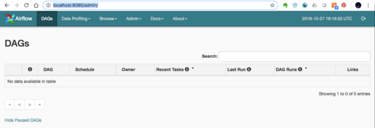

+++
author = "Jose Torrado"
title = "How to get started with Airflow for Data Engineering"
date = "2024-06-09"
description = "Easy and efficient pipeline orchestration"
tags = [
    "data-engineering",
    "pipelines"
]
categories = [
    "airflow",
    "orchestration",
    "data-engineering"
]
image = "blog-cover.png"
+++

## What is Airflow?

One of the cornerstones of data engineering is job orchestration. Once you have build your fancy transformation code, that takes data from millions of sources, cleans it and feeds it into your beautiful dimensional model - you need a way to automate it.

Long gone are the days of bash scripts triggered by a cron schedule, all running on a laptop plugged in 24/7 under your desk at work!


[Apache Airlfow](https://airflow.apache.org/) is a common orcehstration framework used by data engineers to schedule pipelines. Since it uses Python for the writing of workflows, it makes it very convenient and accessible to developers. Some of the other things it brings to the table:
- **Scalable:** You are in total control of the workflow, so can be written in a way to scale to really complex scenarios
- **Extensible:** It is extensible by nature, allowing you to build up on the provided Operators and write your own
- **Dynamic Pipeline Generation:** Pipelines/DAGs are created on te fly upon building the container, this allows for simplication use cases like Templated Workflows
- **Monitoring and Logging:** It comes built in with a dandy logging setup
- **Simple Scheduling:** You can use CRON expressions
- **Open Source:** Transparency and great support by the community

It is great, and the perfect tool to add to your belt if you are getting started.

## Your First Pipeline

### Setting up Airflow

We'll keep it simple in this example - however, depending on what you are trying to achieve with your pipeline, the requirements you will need will vary.

You will need Python. I would also recommend to set up a virtual environment as a best practice (with Python venv for example). Finally, pip install whatever version of airflow you will be using

``` bash
# Get your airflow module
pip install apache-airflow

# Initialize the Airflow DB
airflow db init
```

The `airflow db` functions as your central repository of DAG states. All of the states and history of DAGs is referenced from here - It serves data to the webserver (UI) and scheduler. Along with the `scheduler`, it is the core of airflow operations.

### Creating a Simple Data Pipeline

All airflow operations are based on `Directed Acyclic Graphs` or `DAGs`. You can think of DAGs as the building blocks of your pipeline, they contain the instructions of what actions your pipeline will do and in what order. [Here](https://airflow.apache.org/docs/apache-airflow/stable/core-concepts/dags.html) is the official explanation from the docs. 

There are [three](https://airflow.apache.org/docs/apache-airflow/stable/core-concepts/dags.html#declaring-a-dag) different ways you can define a DAG. Here is an example of what a DAG code would look like - using the standard constructor:

```python
from datetime import datetime
from airflow import DAG
from airflow.operators.dummy import DummyOperator

default_args = {
    'owner': 'airflow',
    'start_date': datetime(2024, 1, 1),
    'retries': 1,
}

dag = DAG(
    'example_dag',
    default_args=default_args,
    description='An example DAG',
    schedule_interval='@daily',
)

start = DummyOperator(task_id='start', dag=dag)
end = DummyOperator(task_id='end', dag=dag)

start >> end 
```

`Operators` are the actions your DAGs will do - in this case the `DummyOperator` does nothing, I am using it to simply showcase the syntax of a DAG. Operators are what make airflow so useful. There are tons of them and the community support is great.

Personally, a lot of the pipelines I write use Cloud services from GCP - airflow provides some great GCP operators, see them [here](https://airflow.apache.org/docs/apache-airflow-providers-google/stable/operators/cloud/index.html). They also provide AWS, Azure and lots more.

### Extending our Example

Let's create a `BashOperator` task for example - it would look something like this if we add it to our DAG above:

```python
from datetime import datetime
from airflow import DAG
from airflow.operators.dummy import DummyOperator
from airflow.operators.bash import BashOperator

default_args = {
    'owner': 'airflow',
    'start_date': datetime(2024, 1, 1),
    'retries': 1,
}

dag = DAG(
    'example_dag',
    default_args=default_args,
    description='An example DAG',
    schedule_interval='@daily',
)

start = DummyOperator(task_id='start', dag=dag)

t1 = BashOperator(
    task_id='print_date',
    bash_command='date',
    dag=dag,
)

end = DummyOperator(task_id='end', dag=dag)

start >> t1 >> end 
```

### Running your DAG

The main you will be interacting with your DAGs is through the Airflow UI. To get this locally, you will start the webserver. The following command will spin up the webserver in your localhost port 8080

```bash
airflow webserver --port 8080
```

For any scheduling to work, you will then need to run the airflow schduler - run this command

```bash
airflow scheduler
```

Once your run these two, you should be able to access the web UI - it should look somehting like this




## Things to Consider...

This was a basic overview of what Airflow is and what is can do. There are several things to keep in mind however when we are talking about data engineering production systems.

### Docker
One standard practice I did not cover here is the use of Docker containers - This makes local development less of a hassle, you are running everything within its own secluded environment in your local machine. It also makes it so that deployments to the cloud are painless - all your dependencies are managed in your Dockerfile

Docker Compose can also be used to simplify the local dev experience - instead of spinning up several containers and executing separate commands to run the webserver, scehduler, db, etc. you can manage all of it with a single command. Some SaaS companies are basically built on this idea, taking open source software and making it easy to integrate to enterprises. Take a look at [Astronomer](https://www.astronomer.io/?utm_term=astronomer.io&utm_campaign=ch.sem_br.brand_tp.prs_tgt.brand_mt.xct_rgn.namer_lng.eng_dv.all_con.brand-general&utm_source=google&utm_medium=sem&hsa_acc=4274135664&hsa_cam=18419792792&hsa_grp=143270970122&hsa_ad=670851261317&hsa_src=g&hsa_tgt=kwd-1777215822888&hsa_kw=astronomer.io&hsa_mt=e&hsa_net=adwords&hsa_ver=3&gad_source=1&gclid=Cj0KCQjwpZWzBhC0ARIsACvjWRPe8WRLqSZErBu6T8MXOBXoHQQ6Q85kS0P8ZCM7sjF_iIkN-y54PNIaAvsZEALw_wcB) for example.

### Cloud
Leads me to the second topic which is hosting. Airflow will in essence generate an application - which needs resources to run 24/7. Running it locally means that it is still hosted on your laptop - for enterprise and production level solutions this is not enough though.

It is common practice to have dedicated hardware (either company owned or Cloud platform) that will be running your orchestrator 24/7. This is what enables full automation of your data pipelines. 

In some companies, part of Data Engineering is to do the platform work required to have these stable solutions - where you will dabble into areas of software engineering and DevOps. 

## Concluding

Apache Airflow can be considered the industry standard for pipeline orchestration. It is an extremely useful and flexible tool for data engineers to create complex data automations. It is also a great introduction to software best practices and even cluster management - because of how it works under the hood. 

Let me know if you would like a more in depth example!
