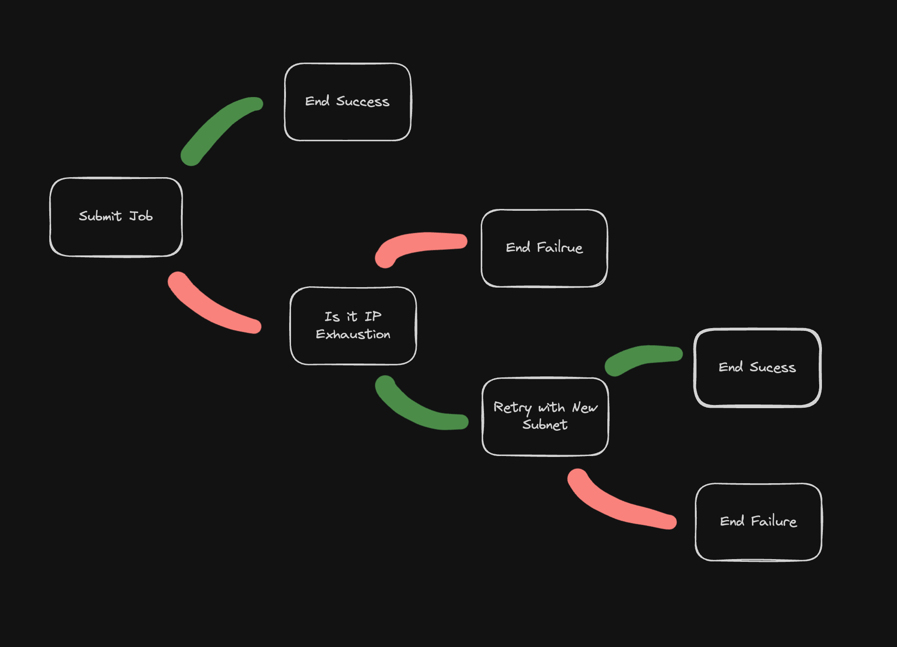

+++
author = "Jose Torrado"
title = "Advanced Airflow: Crafting Robust DAGs with Error Handling and Branching"
date = "2024-10-19"
description = "get good at airflow"
tags = [
    "data-engineering",
    "pipelines"
]
categories = [
    "airflow",
    "orchestration",
    "data-engineering"
]
image = "cover.png"
+++

We have taken a good look at airflow basics in my [previous post](https://torrado.io/p/how-to-get-started-with-airflow-for-data-engineering/), which is an excellent introduction to the concept of orchestration for data pipelines. 

However, most of the real case scenarios you will face will need more than a linear sequence of tasks. In this post, we'll explore advanced techniques for handling errors and creating dynamic workflows in Airflow, with a focus on the BranchPythonOperator and XCom.

## The Power or Branching 

We covered before that one of the best features of Airflow is its dynamic generation of workflows. We can take that a step further by using the `BranchPythonOperator` to make decision on what tasks to execute next at runtime - Making it super useful for advanced and robust error handling.

## Case Study - Executing Jobs in Dataproc

Let's say you are using your DAG to submit serverless batch jobs in GCP Dataproc. The [Dataproc Operator](https://airflow.apache.org/docs/apache-airflow-providers-google/stable/operators/cloud/dataproc.html) will return failure information from GCP to your airflow instance - and you want to use this to inform your task execution sequence.

In this case we will be looking out for `IP Exhaustion errors`, which we will use as a signal to retry our job with a different subnet:

1. **Initial Job Submission:**
   We start with a task that attempts to create a Dataproc job on our primary subnet.

2. **Error Checking and Branching:**
   We use a BranchPythonOperator to check the result of the job submission. If it failed due to an IP space exhaustion, we branch to a task that tries an alternative subnet. If it succeeded or failed for other reasons, we branch to an end state.

3. **Alternative Attempts:**
   We can have multiple alternative subnets, each followed by its own branching task.

4. **Final Status Check:**
   A final branching task checks if any of the attempts were successful and directs the flow to either a success or failure end state.



This is what a simplified version of the diagram above would look like in your code:

```python
def check_job_status(**context):
    # Logic to check job status and decide next step
    if job_failed_due_to_ip_exhaustion:
        return 'try_alternative_subnet'
    elif job_succeeded:
        return 'end_success'
    else:
        return 'end_failure'

with DAG('resilient_dataproc_job') as dag:
    initial_job = PythonOperator(
        task_id='submit_dataproc_job',
        python_callable=submit_dataproc_job,
        op_args=[primary_subnet]
    )

    check_status = BranchPythonOperator(
        task_id='check_job_status',
        python_callable=check_job_status
    )

    try_alternative = PythonOperator(
        task_id='try_alternative_subnet',
        python_callable=submit_dataproc_job,
        op_args=[alternative_subnet]
    )

    end_success = DummyOperator(task_id='end_success')
    end_failure = DummyOperator(task_id='end_failure')

    initial_job >> check_status >> [try_alternative, end_success, end_failure]
    try_alternative >> check_status
```

## The Magic of XCom
But how do we pass information between these tasks? This is where XCom (short for "cross-communication") comes in.
XCom allows tasks to exchange small amounts of data - usually passed back and forth as a struct of key value pairs.

In our Dataproc example, we can use XCom to pass error messages and job statuses between tasks:

```python
def submit_dataproc_job(*args, **context):
    try:
        # Job submission logic here
        context['ti'].xcom_push(key='job_status', value='success')
    except IPExhaustionError:
        context['ti'].xcom_push(key='job_status', value='ip_exhausted')
    except Exception:
        context['ti'].xcom_push(key='job_status', value='failed')

def check_job_status(**context):
    status = context['ti'].xcom_pull(task_ids='submit_dataproc_job', key='job_status')
    if status == 'ip_exhausted':
        return 'try_alternative_subnet'
    elif status == 'success':
        return 'end_success'
    else:
        return 'end_failure'
```

Notice that depending on the excpetion raised, the value passed into the xcom key is different. This can then be retrevied in in the `check_job_status`
to decide which task to execute next.

## Conclusion
By leveraging Airflow's branching capabilities and XCom, we can create DAGs that are not just sequences of tasks, but intelligent workflows capable of adapting to errors and changing conditions. This results in more resilient, self-healing data pipelines that can handle the complexities of real-world scenarios.

Remember, the key to robust DAGs is not just handling the happy path, but anticipating and gracefully managing the many ways things can go wrong. With these advanced Airflow techniques, you're well-equipped to build data pipelines that can stand up to the challenges of production environments.

