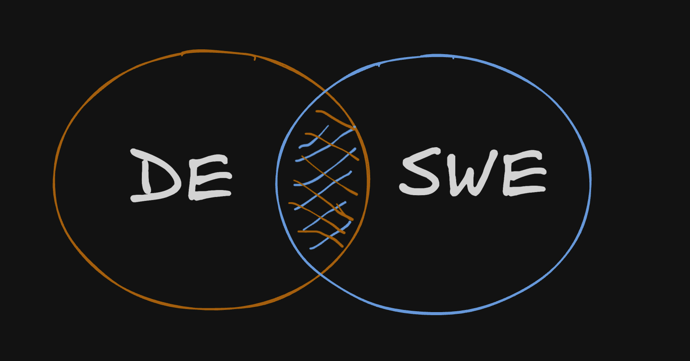

+++
author = "Jose Torrado"
title = "How Data Engineering is actually SWE"
date = "2024-11-16"
description = "And why every DE should care"
tags = [
    "data-engineering",
]
categories = [
    "data-engineering",
    "pipelines"
]
image = "fighting-bots.gif"
+++

## **Data Engineering: A Pillar of Software Engineering**

In the realm of data roles, much of the spotlight tends to shine on data analytics and data science. These fields are often portrayed as the glamorous, exploratory cousins of the data world, full of Jupyter notebooks, trial-and-error experiments, and the occasional "eureka" moment. While they certainly have their disciplined facets, their core nature often leans toward the exploratory and the innovative.

## **Defining Data Engineering**

Data Engineering, however, is a bit different in its purpose and execution. If data science is the intrepid explorer, data engineering is the meticulous city planner who turns those discoveries into a thriving metropolis. It's the art of transforming the exploratory results of data scientists and analysts into robust, production-grade products. *This process aligns closely with the principles and practices of software engineering.*

## **The Role of a Data Engineer**

As a data engineer, your role involves developing highly available systems that provide data to your stakeholders. Whether these systems feed internal dashboards for routine managerial reviews or stream data to APIs for customer-facing applications that detect suspicious credit card activity, the applications are varied and critical.

## **Parallels with Software Engineering**

The parallels with software engineering become apparent when considering the need for scalable systems capable of efficiently processing increasing volumes of data. This requires careful attention to availability, platform constraints, and architectural design. Maintenance and operation of these systems often include CI/CD pipelines, Kubernetes clusters, and container orchestration.

## **Team Coordination and Standardization**

As the scale of operations grows, so does the team. This necessitates the standardization of:
- **Coding Best Practices** (OOP, DRY, [SRP](https://en.wikipedia.org/wiki/Single-responsibility_principle), Documentation)
- **Code Versioning, Branching and Promotion Strategies** 
- **Developer Tooling** 

How do you empower your engineers to excel without tripping over their own shoelaces? Think Dockerized testing environments that replicate cloud systems locally, and robust local development environments that foster creativity without friction.

## **Ensuring Reliability and Compliance**

Reliability is paramount. A comprehensive testing suite is not just beneficial; it's essential. Think a comprehensive suite including:
- **Unit Tests**
- **Integration Tests**
- **Vulnerability Scans**
- **Code Audits** (ex: Code Reviews and scans)

And then there's the ever-important realm of privacy and compliance. Handling customer data demands rigorous governance. Who can access your data? How do you manage regional data separation and adhere to stringent regulations like GDPR?

## **Closing Thoughts**

As systems and pipelines gain formality and importance to the business, data engineering reveals its true colors as a branch of software engineering. Those who have navigated the complex waters of large-scale data projects will likely nod in agreement: Data Engineering is, indeed, software engineering with a specific focus. It should adhere to all the best practices and principles that define software engineering excellence.

Ultimately, *data engineering is not merely a related discipline but a fundamental component of software engineering*, and data engineers should embrace this perspective by integrating best practices and standards into their system designs.
