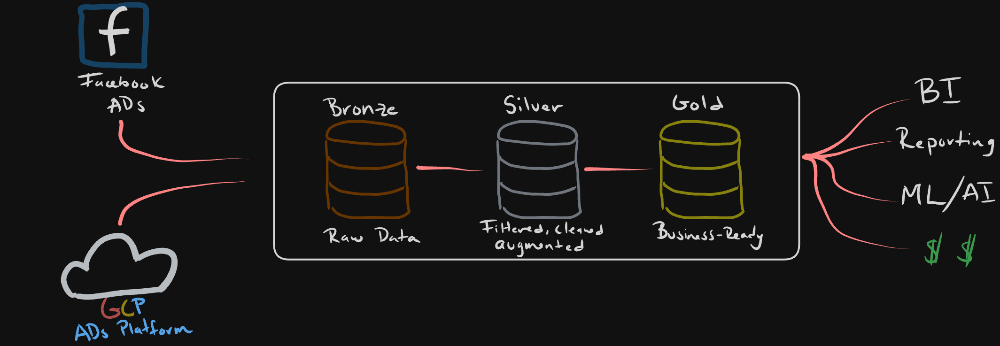

+++
author = "Jose Torrado"
title = "The Midas touch of DE"
date = "2025-01-13"
description = "Understanding Medallion Architecture and what it's good for"
tags = [
    "data-engineering",
    "architecture"
]
categories = [
    "architecture",
    "data-modeling",
    "data-quality"
]
image = "Medallion-cover.png"
+++


As I am reading a learning more about data engineering best practices I came across the concept of `Medallion Architecture`. 
I am interested in learning more about how to squeeze every last bit of performance out of my data - accompanied with the fact of calling a dataset "gold",
it peaked my interest.

I did however find it to be a bit confusing and not exactly what I had expected, hence this post.

## So what is it?

I'll start with what it is `NOT` (and what I expected it to be): It is not a method/process that defines step by step how to create a "Golden" perfect dataset.

It is also `NOT` a method to model your data in a way that it performs so well that it wins olympic gold when queried...

What it actually `IS`:

It is basically a tiered approach to describe a data flow, from the source all the way to the point where it is consumed by business. It is a three tiered (or "hop")
approach, consisting of bronze, silver and gold datasets or "steps"

It reminds me of the [NOVA classification](https://en.wikipedia.org/wiki/Nova_classification) of foods, where the lowest correlates to no/minimal processing and the highest correlates to the most processing.

Similarly, the `Medallion Architecture` describes datasets based on the processing and wrangling of the datasets as compared to its raw form. [It also kind of reminds me of this](https://i.kym-cdn.com/entries/icons/original/000/036/027/trueselfcover.jpg)

We will run through each of the levels using a hyopthetical ad tech company's ad campaign performance data flow.



## Bronze 
This will be your `raw data`, the goal is to match it as close as possible to your external systems - your data producers.
Bronze is the lowest level of processing, so at most you might find some metadata attached to capture the load date/time, processID, etc.

The main purpose of this layer is to provide a historical archive (cold storage, of sorts) of the source data to allow historical reprocessing without 
having to re-pull from the source system.

This is usually a data lake where data is dumped quickly and often. Think some blob storage like GCS or S3 buckets for example. 
It could also be some sort of relational database, depending on the schema constraints you might want to have for your use case.

For our practical example, lets say we are ingesting raw data from two main platforms where we run our ads, Google and Facebook ads. Your ingestion table might look something like this: 

```sql
CREATE TABLE bronze_raw_data
(
  source_system STRING,
  ingestion_timestamp TIMESTAMP,
  raw_data STRUCT<
    field1: STRING,
    field2: INT,
    field3: ARRAY<STRING>,
    ... -- Additional fields as needed
  >
)
USING DELTA;
```
A big point of the bronze layer is flexibility - remember you are capturing your raw data exactly as it is sent to you, with all its errors and impurities.
You will want to consider possible changes in the data itself when you are designing this system, it should be loosely coupled and flexible enough to handle these changes without breaking 
(ex: data type changes, new unexpected columns, etc.)

## Silver 

The silver layer is where we will do most of the cleansing and wrangling to enrich the data and make it more useful for our downstream. In this step you will consider doing some of the following:
- Duplicate removal
- Apply your team/company column naming standardization
- Any kinds of useful unit conversions (ex: currenxy conversions to USD)
- Joins of bronze tables to enrich datasets 

The goal here is to cleanse the data `just enough` so that the Silver layer can provide a trustworthy and standardized "Enterprise view" of key business data points (ex: master customers, stores, non-duplicated transactions and cross-reference tables).

Emphasizing on the just enough: the priority is usually on the speed and agility to ingest and make data available. This means that any transformation not considered critical would be shifted into the Gold layer.

The Silver layer will usually be the source Data Engineers, Scientists, Analytsts, etc. will use to further create project and analysis to answer business problems in the Gold Layer. 

Considering the above, something like this snip you might expect to see in the Silver layer:

```sql
CREATE TABLE silver_ad_performance AS
SELECT
  COALESCE(g.campaign_id, f.campaign_id, p.campaign_id) AS campaign_id,
  COALESCE(g.ad_group_id, f.ad_set_id, p.ad_group_id) AS ad_group_id,
  COALESCE(g.ad_id, f.ad_id, p.creative_id) AS ad_id,
  COALESCE(g.impressions, f.impressions, p.impressions) AS impressions,
  COALESCE(g.clicks, f.clicks, p.clicks) AS clicks,
  CASE
    WHEN g.cost IS NOT NULL THEN g.cost
    WHEN f.spend IS NOT NULL THEN f.spend * exchange_rate
    WHEN p.cost IS NOT NULL THEN p.cost * exchange_rate
  END AS cost_usd,
  COALESCE(g.date, f.date, p.date) AS date,
  cm.campaign_name,
  cm.campaign_objective,
  cm.target_audience
FROM bronze_google_ads g
FULL OUTER JOIN bronze_facebook_ads f
  ON g.campaign_id = f.campaign_id AND g.date = f.date
FULL OUTER JOIN bronze_programmatic_ads p
  ON g.campaign_id = p.campaign_id AND g.date = p.date
LEFT JOIN campaign_metadata cm
  ON COALESCE(g.campaign_id, f.campaign_id, p.campaign_id) = cm.campaign_id;
```

## Gold

And... we arrive at Gold - This is made up of consumption ready tables that aim to solve very specific business problems. This layer's use is mainly reporting, therefore it tends to use denormalized and read-optimized models that leverage less joins. 

In real-world projects, multiple teams/users ask for datasets with differing grains from the same underlying fact and dimension tables. While you can join the necessary tables and aggregate them individually for each ask, it leads to repeated code and joins.

Companies will typically do the follwoing to avoid this issue:
- OBT: One big table. It is a fact table with multiple dimension tables left joined to it.
- Pre Aggregate Tables: Depending on the granularity needed, the OBT is rolled up. This would be the dataset our end-users read. 

For our example, say business wants to see the following metrics:
- Daily campaign performance
- Ad group effectiveness
- ROI by campaign objective

The tables would be generated with something like this:

```sql
CREATE TABLE gold_daily_campaign_performance AS
SELECT
  date,
  campaign_id,
  campaign_name,
  campaign_objective,
  SUM(impressions) AS total_impressions,
  SUM(clicks) AS total_clicks,
  SUM(cost_usd) AS total_spend,
  SUM(clicks) / SUM(impressions) AS ctr,
  SUM(cost_usd) / SUM(clicks) AS cpc
FROM silver_ad_performance
GROUP BY date, campaign_id, campaign_name, campaign_objective;

CREATE TABLE gold_ad_group_effectiveness AS
SELECT
  ad_group_id,
  campaign_id,
  campaign_name,
  target_audience,
  AVG(impressions) AS avg_daily_impressions,
  AVG(clicks) AS avg_daily_clicks,
  AVG(cost_usd) AS avg_daily_spend,
  SUM(clicks) / SUM(impressions) AS overall_ctr,
  SUM(cost_usd) / SUM(clicks) AS overall_cpc
FROM silver_ad_performance
GROUP BY ad_group_id, campaign_id, campaign_name, target_audience;

CREATE TABLE gold_roi_by_campaign_objective AS
SELECT
  campaign_objective,
  SUM(impressions) AS total_impressions,
  SUM(clicks) AS total_clicks,
  SUM(cost_usd) AS total_spend,
  SUM(revenue) AS total_revenue,
  (SUM(revenue) - SUM(cost_usd)) / SUM(cost_usd) AS roi
FROM silver_ad_performance
JOIN conversion_data ON silver_ad_performance.ad_id = conversion_data.ad_id
GROUP BY campaign_objective;
```
## In summary

Medallion architecture is nothing else but a nomenclature to describe the data flow from its rawest form to its most processed. Accompanied with solid engineering practices, it brings standardization and build trust on the data. This allows a company to make quicker and more informed business decisions.
