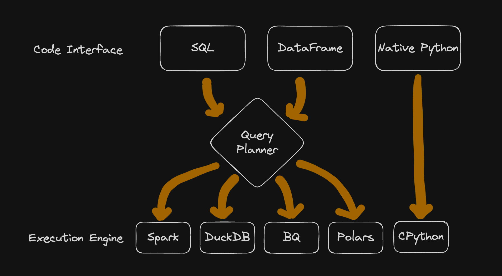

+++
author = "Jose Torrado"
title = "Python vs SQL for Data Pipelines"
date = "2024-07-14"
description = "Defining the best tool for data transformations"
tags = [
    "sql",
    "python",
    "pipelines"
]
categories = [
    "data-transformation",
    "data-engineering"
]
image="sqlvspython.png"
+++

I'll save you some time.

> There is no tool supremacy when it comes to ETL - SQL and Python are both excelent, that is why they are still around and extensively used

That being said though, [choosing the right tool for the job is very important](https://en.wikipedia.org/wiki/Law_of_the_instrument).
To decide on one, you will want to know the strenghts and weakneses of both.

## Execution Engines and Coding Interfaces

Your written code is simply a way for you to interact with an execution engine. 
It is an abstraction, a developer-friendly interface to comunicate with the execution engine running your transformations.

The most popular data wrangling tools work this way (Pandas, Polars, PySpark, SQL). Here is a diagram depicting the interface and execution engine relationships of some of these:




### Types of Execution Engines

- `Single Node Systems`: Designed to process data on a single machine (eg: Pandas, Polars, DuckDB)
- `Massive Parallel Processing`: Systems designed to run processing tasks on multile nodes (eg: Spark, BigQuery, Snowflake, ...)
- `Langugage Engine`: A process that will take your written code and run the necessary logic (eg: CPython, JVM, BEAM, ..)

### Types of Coding Interfaces

- `Native`: Using language specific data structures. In Python this means lists, dicts, tuples, etc. (Other languages here: Rust, Go, etc.)
- `Dataframe`
- `SQL`

## Choosing the tool for the job

Developer's familiarity and existing infrastructure are crucial - save on costs, use the frameworks already implemented by your org.

```
No need to reinvent the wheel.
```

However, assuming a greenfield project - here are the criteria that will help you narrow down which choice is right for your pipeline

### What does your Workload look like?

**Your choice of execution engine will affect what kind of data processing you can do, the size of data to be processed and the coding interface.**

Consider the following:
1. `Performance`: MPPs and Single node processing systems will generally perform faster than a custom Python implementation - because of the built in oprimizations for data processing efficiency

2. `Type of Transformation`: SQL type transformations run blazing fast in MPPs. They are **terrible**, however, when you need complex recursion, looping, or unsupported MLS algos (not surpported by MPP libraries like Spark MLLib). 
If your algo is not supported, or you require some of these complex operataions, it is better to go with Python

3. `Cost`: Money, bread, bucks, cheddah. MPPs are expensive - even more when you have vendors managing them. Single node and Python pipelines can be ran on your laptop, at no additional cost.

4. `Data Size`: Native Python will begin having issues at the 100s GB mark. 
Single-node systems have similar processing limit. 
MPPs were created to process TB/PB of data - and they are good at it

5. `Data Location`: If you are storing your data in an MPP (eg: BigQuery), it is easiest to process it there than bring it out to another system

### Who is mantaining your Pipleine?

You want to think about code reusability and how easy it is to test your code when picking a coding interface for your team.

Here are some criteria to consider when picking one:

1. `Learning Curve`: SQL is easier to learn than Python. More pepople know SQL than Python - makes it more accessible to stakeholders. **SQL wins**
2. `Code Quality`: While SQL provides _some_ reusability with CTEs/temp tables/Stored procedures, they can be hard to manage, mantain and monitor.
Python is a general purpose programming language equipped with a wide variety of libraries that helps you wirte well-designed software. **Python wins**
3. `Non tabular data`: Python can work with any arbitrary set of data (images, excel files, json, etc.). While some SQL systems allow us to work with non tabular data (eg: json, arrays, ...), it must be wrangled and formatted properly. **Python wins**
4. `Testing`: Testing Python code is much simpler than testing a sql transformation. Python also has libraries like _pytest_ that make things even easier. **Python wins**
5. `Creating Visualizations`: Most BI Tools integrate really well with SQL. Python also has great visualization libraries like plotly, dash, and streamlit for reporting. **SQL and Python win**

## Conclusion

The choice is really based on your use case - but leveraging the criteria above can make your decision much easier.

<sub><sup>Image cred: https://images.datacamp.com/image/upload/v1671797982/SQL_vs_Python_Header_a3d0ea728a.png</sup></sub>
